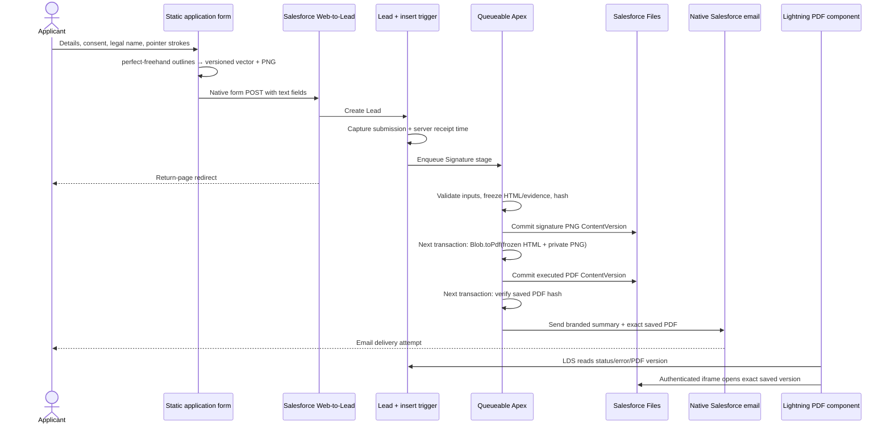

# NTE agreements — technical walkthrough and presentation guide

This project turns the supplied partner/sponsor application into a Salesforce-native electronic agreement workflow. The external site is static HTML, CSS and JavaScript. Salesforce stores the submission, generates its PDF and emails the saved document. There is no paid signature/document-generation service or external application backend.

This is an experimental implementation in **Megistos only**. Use [V1-ISSUES.md](V1-ISSUES.md) alongside this walkthrough: it records material defects and assumptions awaiting decisions. A demonstrated working journey is not a production-readiness certification.

## A suggested team demonstration

1. Open the published partner/sponsor form. Explain that the source form's fields, styling and conditional questions have been preserved.
2. Enter synthetic organisation/contact details and an email inbox you control. Choose **Gold Partner** for the complete supplied benefits schedule. Other packages have their supplied prices but deliberately blank benefit schedules.
3. Expand **Read your agreement**. Show how the organisation, signatory, selected package(s), fee and event details appear in the document. The agreement version is visible.
4. Enter the legal name, tick the declarations and draw a signature. Demonstrate Undo/Redo/Clear. A tap does not pass validation. If you edit contractual details after signing, the form clears the signature and consents for a fresh review.
5. Submit once and keep the reference. Explain that the return page acknowledges submission; Web-to-Lead does not return an authenticated processing receipt.
6. In Megistos, open **NTE Agreements → Leads** and the new record. Refresh the agreement card while the background work completes.
7. Browse the **saved PDF inside the record page**, including the final signature page. Use the native PDF toolbar to download/print or **Open PDF** for a separate window. **Related → Files** contains the PNG derivative and executed PDF.
8. Open the received email. Its NTE branding surrounds the actual frozen organisation, package(s), fee, signatory, time, version and reference. Open the attachment and compare it with the Salesforce File.
9. Close the presentation with the open functional issues and client decisions below. Do not present intentionally blank contractual schedules as approved package benefits.

## End-to-end architecture

## What happens at each step

### 1. Static form and configuration

`public/partner-sponsor-application.html` remains a normal external form. `assets/forms.js` preserves the original validation, package selection, totals and conditional questions. `assets/config.js` maps field API names to the custom-field IDs used by Megistos Web-to-Lead. These IDs and the org ID are public routing identifiers, not credentials.

The site needs no Salesforce login. On GitHub Pages, the browser posts directly to Salesforce's native Web-to-Lead endpoint. The return URL is resolved relative to the page, so both local preview and the published project work beneath their respective paths. The local Python server only serves static files; it performs no application processing.

The displayed agreement comes from a generated bundle shared with Apex. `config/agreement.json` contains event details, version, fees, tax/payment wording and package schedules. `scripts/build-agreement.mjs` turns the supplied extracted terms plus this configuration into controlled HTML and an identical JSON bundle for the browser and the private Salesforce Static Resource. SHA-256 identifies the exact bundle.

**Maintenance qualification:** package checkbox prices and some annual form wording still live in the inherited HTML. Configuring a new fee alone does not update those controls, and test fixtures also contain current event/price literals. See PUB-02 and PLAT-01 before changing a catalogue.

### 2. Signature capture and two representations

`assets/signature-pad.js` handles Pointer Events and uses the locally bundled MIT-licensed **perfect-freehand 1.2.3** to generate smooth outlines. It uses real pen pressure when available and simulated pressure otherwise. Pointer capture and touch behavior prevent the page scrolling during an active stroke. Multiple disconnected strokes are retained.

The stored master contains version 1, a fixed 600 × 180 coordinate viewport and controlled path strings. The schema accepts numeric `M`, `L`, `Q` and `Z` contours, not arbitrary SVG/HTML. Decimal precision is bounded. “Master” means the retained completed outline; raw high-frequency device events have already been resampled/rounded and are not retained as a lossless recording of the physical pen.

The same browser paths paint a transparent PNG on an off-screen Canvas. Normal output is 1200 × 360; bounded smaller derivatives use 900 × 270 or 600 × 180. The vector and PNG Base64 each have a 28,000-character transport bound. This avoids unsupported Web-to-Lead file uploads and limits Apex heap/field use.

**Trust qualification:** the honest client produces matching representations, but Apex does not independently prove they depict the same signature. Individually valid replacement PNG/vector payloads are possible (PUB-03). Neither a drawn name nor its hash verifies the identity of the person operating the browser.

### 3. Native Web-to-Lead submission

At submit time, the client checks the form, signature and declarations; fills hidden mapped text fields with the vector, PNG Base64, agreement version/config hash and browser timestamp; and posts the native form. It does not upload a multipart file, call a public Apex endpoint or expose a session token.

`Booking_Reference__c` is a unique case-insensitive external reference. Replaying an identical reference cannot create a second Lead with that reference. Completing another form with a new reference is a new application; this is not identity-based deduplication.

The native endpoint provides a redirect, not a structured Lead ID or async outcome. Standard Web-to-Lead quotas, validation/duplicate rules and assignment rules still apply. The form's JavaScript honeypot is not a server-enforced anti-bot gate; PUB-04 remains open.

### 4. Lead insert and evidence capture

`NTEAgreementLead.trigger` delegates to `NTEAgreementLeadHandler`. Before insert, identified agreement submissions receive an application snapshot and trusted Salesforce receipt time. Status starts at `Received`. After insert, a worker is enqueued. Ordinary later Lead contact edits do not rewrite the frozen signed application.

The handler protects signed evidence from ordinary record updates and allows narrowly scoped internal processing updates. The reviewer found an early-return gap for inserts that omit every agreement discriminator while submitting generated fields (PUB-01). That boundary needs correction before treating every displayed processed record as pipeline-authenticated.

A Flow wrapper was intentionally omitted: insert-time evidence protection, binary decoding, native PDF rendering and transactional file/email stages already require Apex. There is no Flow to activate or paid automation package to install.

### 5. First async transaction: signature File

`NTEAgreementWorker`, stage `Signature`, validates bounded JSON shape, contour commands/coordinates, minimum signature geometry and PNG Base64/header/dimensions. `NTEAgreementTemplate.completeEvidence` checks version/hash, event, packages, configured totals, required identity/contact fields, declarations and the browser timestamp window.

It generates the controlled agreement HTML with escaped merge values. The full snapshot contains application data, legal name/contact email, selected packages/fee, declared signing time, receipt time, agreement version/hash and frozen HTML. Signature vector and PNG hashes are added; the exact serialised snapshot is hashed. The snapshot bound is 120,000 characters.

`NTEAgreementGateway.createFile` inserts a `ContentVersion` with `VersionData` from decoded Base64 and `FirstPublishLocationId` set to the Lead. Salesforce creates the File/link. On commit the status is `Signature Saved` and the temporary Base64 field is cleared. The vector remains permanently on the Lead.

### 6. Second async transaction: native PDF and saved File

The next worker verifies the retained evidence and PNG File hashes. It inserts only a controlled private File image URL into the frozen HTML, along with receipt/hash audit details, then calls **`Blob.toPdf(String html)`**. This native API and committed Salesforce-hosted PNG behavior were tested in Megistos at API 67.

The PNG must exist in a committed transaction before the renderer reads it. Raw SVG is not sent to the renderer. There is no public File share, external PDF API or paid Salesforce Document Generation dependency.

The worker checks that output resembles a usable PDF with an image object, saves a new PDF `ContentVersion` linked to the Lead, records its hash and exact version ID, and commits `PDF Saved`. These structural checks do not replace visual rendering tests or establish equivalence between PNG and vector.

### 7. Third async transaction: branded email

The email worker reads the actual saved PDF and checks its hash. The email recipient comes from the frozen main contact `Email`, not the finance contact and not a later Lead edit. `Messaging.SingleEmailMessage` adds an HTML body, plain-text alternative and `Messaging.EmailFileAttachment` containing those saved PDF bytes.

`NTEAgreementEmail` is a separate Static Resource built from `config/branded-email-template.html`. Nine escaped frozen values populate the NTE navy/cyan design: organisation, packages, fee, signatory, signed time, version, reference, contact email and event code. This separation permits presentation changes without changing the legal agreement bundle/version.

The saved status and send occur in one Salesforce transaction. A rejected send throws, rolling back the tentative sent state; the failure finalizer records the error. A PDF-generation failure does not reach the legitimate success-email path. `Email Sent` means Salesforce accepted the send; inbox receipt is a separate observation.

The dev sender currently uses the executing user's verified Salesforce email with the display name “National Transition Event”. Customer rollout needs a client-controlled verified sender/domain and deliverability configuration. The logo is a remote image on the supplied NTE GitHub site; email clients can block remote images. The text summary and attached PDF remain usable without the image.

### 8. Document-focused Lightning display

`nteAgreementViewer` keeps its existing component API name for page compatibility but now displays the actual document. Lightning Data Service reads only status, error and the saved PDF reference. A validated `068…` ContentVersion ID builds an authenticated relative File URL; the iframe pins that executed version, not the latest version of a ContentDocument.

The component is responsive and supplies Refresh, an Open PDF fallback, and an Operator-only retry for appropriate failures. The browser's native PDF toolbar provides document browsing, download and print. It adds no PDF library and does not delete the separately retained vector evidence.

Megistos's `.pdf` behavior was changed from **Hybrid** to **Execute in Browser** in File Upload and Download Security. This is an **org-wide PDF display setting**, not a component-only setting or a File access grant. Other file types were left unchanged. Salesforce documents this as the prerequisite for the [iframe approach](https://developer.salesforce.com/blogs/2019/07/display-pdf-files-with-lightning-web-components). Destination org policy and mobile/browser PDF support must be checked separately.

## Metadata and access boundary

The portable core contains **90 metadata components**: 67 Lead fields, 13 Apex classes (8 runtime, 4 test classes and a test-data factory), 1 trigger, 2 LWC bundles, 2 permission sets, 1 custom permission, 2 Static Resources, 1 Lightning app and 1 record page. [METADATA.md](METADATA.md) lists every field/API name/type/limit.

48 custom fields reproduce the supplied form mappings; 19 are new agreement/evidence fields. Standard Company, FirstName, LastName, Title, Email and Phone are reused. A future org may already have equivalent fields: reconcile them before deploying this full set.

Trusted internal automation uses explicit system-mode reads/writes at API 67. The UI uses LDS, and retry checks a custom permission and a user-mode record query. Viewer and Operator permission sets do not grant View All, Modify All or delete access. The completed test confirmed private File links with InternalUsers visibility; destination defaults and ordinary-user access remain acceptance checks.

The existing Megistos Lead Layout gained a Files related list. Its org-specific overlay and unrelated managed-package references are excluded from the portable/public source. The NTE app uses its own record-page assignment rather than replacing all Lead page defaults.

## Failures, recovery and operating limits

| State | Meaning | Operator action |
| --- | --- | --- |
| Received | Lead captured; waiting for signature processing | Refresh, inspect Apex Jobs if delayed |
| Signature Saved | PNG committed; PDF pending | Inspect job if stalled |
| PDF Saved | Exact PDF committed; email pending | Inspect job/deliverability if stalled |
| Email Sent | Salesforce accepted the send | Check recipient inbox/Spam if missing |
| Error | Processing failed with recorded stage/error/job details | Resolve cause; authorised retry for an unsent agreement |

The retry route resumes from committed evidence/Files. It does not resend an already-sent agreement or silently replace invalid/stale signed terms. Malformed signatures or changed contractual data require a fresh submission.

One agreement normally uses **three Queueable executions and two Files**. Web-to-Lead has a standard 500-per-day allocation; email, async and storage limits are also shared with other org workloads. Serial processing bounds per-transaction work but does not establish correct arbitrary-volume imports. [Salesforce's Queueable guidance](https://trailhead.salesforce.com/content/learn/modules/asynchronous_apex/async_apex_queueable) documents the one-child async restriction and default Developer/Trial depth; ASYNC-01/02/03 record specific open implementation consequences.

No recurring monitoring, reconciliation job or automatic retry service has been installed. Cancelled jobs and failures that prevent finalizer logging can strand work. An operator must own pending/failed records, quotas and recovery. Never equate suppressing error messages with preventing failures.

## Assumptions and deliberate omissions

- General wording is year-neutral; the current event/date/venue and inherited logistics must still be reviewed for each NTE. Updating configuration is not yet a fully automated annual rollout.
- Only Gold's supplied benefits are populated. Other schedules and the reusable paperwork deadline are blank at the user's request.
- The Word's no-VAT wording takes precedence in this build over the original form's conflicting prices-exclude-VAT statement; the client must decide the correct treatment.
- There is one applicant signatory. No organiser countersignature, verified email challenge, identity proof, cryptographic signing certificate, external timestamp authority or immutable archive exists.
- Hashes detect changes to retained bytes; they cannot prevent a privileged administrator changing code or deleting records/Files, and they do not prove the two submitted signature formats match.
- Lead conversion/deletion and long-term agreement ownership need a client policy. The current evidence model is Lead-based.
- Invoice/payment preference fields are collected, but invoices, Stripe payments and payment reconciliation are not performed.
- The public site and privacy/support links use client branding, but hosting an experiment does not make it a client-approved contract service. Use controlled test data and a recipient inbox you control.
- Megistos is an Enterprise Edition trial, with recorded expiry 2 May 2027. This is not a claim of unlimited free Salesforce capacity or an independent permanent hosting entitlement.

## Before a customer sandbox or production release

1. Decide and resolve/accept the issue register with the client's architects, especially server-generated-state trust, signature representation integrity, native CAPTCHA, catalogue consistency and async recovery.
2. Approve complete terms, schedules, VAT, event logistics, privacy notices, signature authority process and retention. Determine legal suitability with the client's advisers; this project does not certify it.
3. Inspect the intended org's fields, automation, access, limits and API/native PDF behavior. Reconcile mappings and integrate with its trigger/automation conventions.
4. Use a separate target configuration. The provided build/deploy helper deliberately pins Megistos; do not casually remove that guard. Generate the destination Web-to-Lead IDs/endpoint and test the real POST.
5. Configure native reCAPTCHA v2, verified sender/domain/DKIM, deliverability, owner assignment, least-privilege File access and the inline-PDF policy. Avoid conflicting early auto-responses.
6. Test real devices, maximum payloads, restricted users, multi-package agreements, actual inboxes and attachments, duplicate/retry paths, failure isolation, two-record/bulk jobs and Lead conversion/deletion recovery.
7. Assign operational ownership and monitoring, back up evidence, and rehearse version releases. Drain pending work or implement overlapping versions; the website and Salesforce deployments are not atomic.

## Build, deployment and hosting

`npm test` runs the local signature suite. `npm run build` rebuilds the agreement bundle, form/mappings and branded email. No dependency installation is required for the vendored browser library. Generated Apex tests are committed; `scripts/build-tests.mjs` uses only a synthetic fixture in the published project.

The PowerShell deployment helper defaults to validation and checks alias-resolved org ID/name before any metadata deployment. It explicitly targets Megistos and does not switch the default org, deploy unrelated layout metadata or assign permissions automatically. It runs four named Apex test classes.

GitHub Pages serves the `gh-pages` branch, containing **only the `public/` subtree**. The `scripts/publish-site.ps1` helper checks the exact repository, runs tests/build from clean committed main, and publishes that subtree without a force push. Main-only commits do not republish the site. There is no Salesforce login secret or Salesforce deployment in this process. A website-only terms/config change without matching Salesforce metadata will fail the version/hash checks, so release both deliberately. GitHub documents the [Pages branch publishing](https://docs.github.com/en/pages/getting-started-with-github-pages/configuring-a-publishing-source-for-your-github-pages-site).

The original NTE GitHub repository remains unchanged. The new source export excludes raw org metadata, original Word files, actual applicant/signature evidence, inbox attachments and Salesforce authentication files. Public Web-to-Lead identifiers necessarily remain in the working form.
